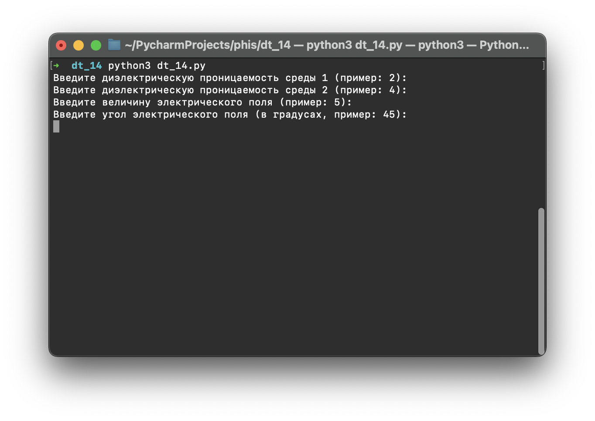
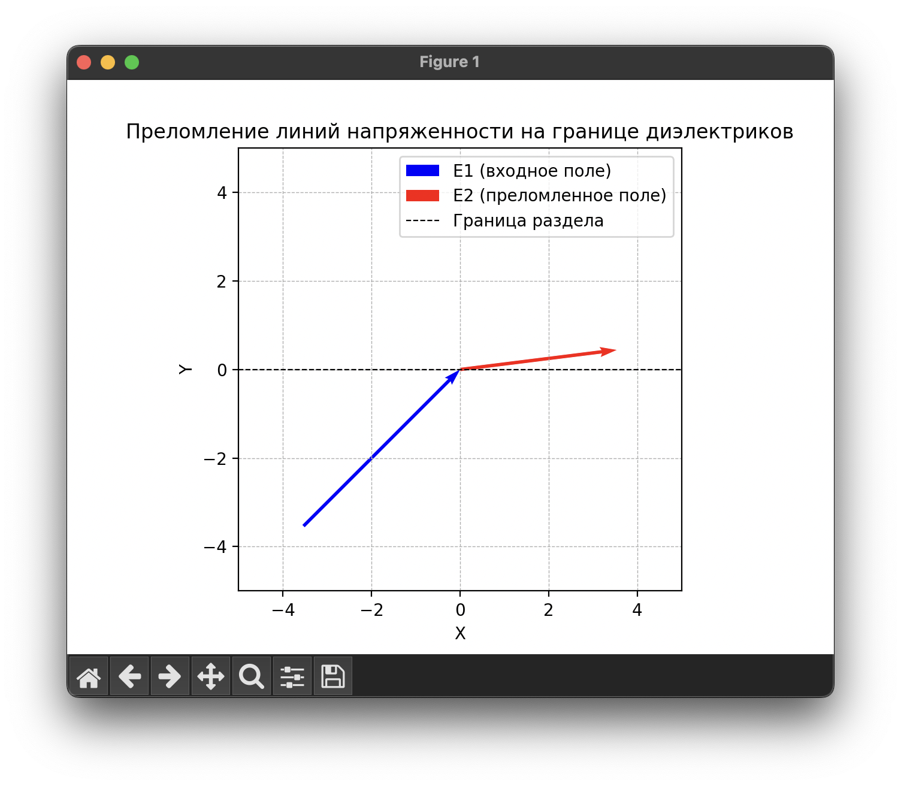

## Задание:

Визуализация граничных условий для границы раздела двух диэлектриков. Показать преломление линий напряженности и
электрического смещения. Входные параметры: диэлектрические проницаемости двух сред, модуль и направление напряженности
или индукции (внешнего поля / поля без диэлектрика).

## Пример:

